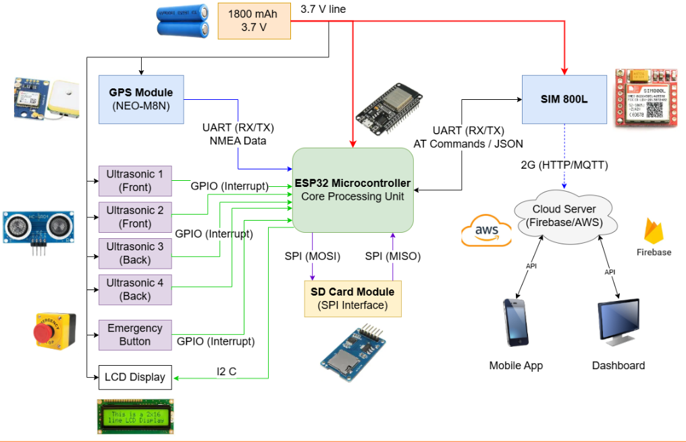

# RouteLK : Smart Bus Tracking & Passenger Assistance App

---

## Team
-  E/21/017, Thimal Adeesha, [e21017@eng.pdn.ac.lk](mailto:e21017@eng.pdn.ac.lk)
-  E/21/126, Dinithi Epitakaduwa, [e21126@eng.pdn.ac.lk](mailto:e21126@eng.pdn.ac.lk)
-  E/21/372, Lakshika Seneviratne, [e21372@eng.pdn.ac.lk](mailto:e21372@eng.pdn.ac.lk)
-  E/21/391, Walter Ravindu, [e21391@eng.pdn.ac.lk](mailto:e21391@eng.pdn.ac.lk)

<!-- Image (photo/drawing of the final hardware) should be here -->

<!-- This is a sample image, to show how to add images to your page. To learn more options, please refer [this](https://projects.ce.pdn.ac.lk/docs/faq/how-to-add-an-image/) -->

<!--  -->

#### Table of Contents
1. [Introduction](#introduction)
2. [Solution Architecture](#solution-architecture )
3. [Hardware & Software Designs](#hardware-and-software-designs)
4. [Testing](#testing)
5. [Detailed budget](#detailed-budget)
6. [Conclusion](#conclusion)

## Introduction

Public transportation systems in developing regions often suffer from poor visibility, unpredictable arrival times, overcrowding, and lack of reliable passenger information. Traditional bus systems operate without real-time tracking, accurate occupancy monitoring, or intelligent data handling mechanisms, resulting in passenger inconvenience and operational inefficiencies.

The Bus Tracking & Passenger Assistance System is an IoT- and cloud-powered intelligent transport solution designed to address these challenges. The system integrates embedded hardware, real-time GPS tracking, passenger counting logic, cloud-based data processing, and a mobile application interface to deliver:

- Real-time bus location tracking
- Intelligent passenger counting
- Dynamic crowd-level estimation
- Traffic-aware arrival time prediction
- Robust offline data handling

By combining embedded systems (ESP32 + IR sensors + GPS), wireless communication, and scalable backend services, the solution ensures accurate monitoring even in unstable network conditions.

This system demonstrates how IoT and cloud technologies can modernize public transportation with cost-effective and scalable architecture.

## Solution Architecture

### High Level Architecture Diagram

### Edge Layer (Bus Device):
An ESP32 board connected with peripheral components installed inside the bus collects passenger counts using IR sensors and tracks GPS location. Data is packaged in JSON format and stored locally if internet connectivity fails.

### Communication Layer:
Telemetry is transmitted every 10 seconds via 2G connectivity using MQTT or REST. If the network drops, data is cached on an SD card and automatically synchronized once connectivity is restored.

### Cloud Backend Layer:
The backend receives and reorders timestamped data, stores it in a database, exposes REST APIs to the mobile app, and classifies crowd level.

### Application Layer:
The passenger mobile app displays live bus tracking, traffic-aware ETA, crowd levels, and notifications using map services such as Google Maps Platform.

### Data flow Diagram

## Hardware and Software Designs

### Main Hardware Components

- ESP32 CP2102 Type-C Development Board
- NEO-M8N GPS Module
- IR Sensor Pairs (4 Sensors / 2 Doors)
- SIM 800L GSM Module
- SD Card Module
- 3.7 V Li-Ion 1800 mAh battery
- 16x2 I2C LCD Display
- Emergency Push Button

### Software Stack

### Firmware

- ESP32 (C/C++ – Arduino / ESP-IDF)
- FreeRTOS (built-in)
- JSON Serialization

### Cloud/Backend

- REST API Framework
- MQTT Broker
- HTTP / MQTT Protocol
- Cloud Hosting (AWS / Firebase)

### Database

- NoSQL (Firebase)

### Frontend/Mobile Application

- Android /Flutter/ Web
- REST Client

## Testing

### Hardware Testing

- IR Sensor Testing for accurate passenger entry/exit detection.
- GPS Testing in both stationary and moving conditions.
- GSM module Testing for reliable connectivity.

### Software Testing

- Offline Mode Testing for simulated internet disconnection.
- API & Backend Testing.
- Mobile App Testing for smooth real-time map updates, correct crowd-level visualization, and accurate ETA display.

### End-to-End Integration Testing

- Full system tests for the complete data flow:
Sensor detection → ESP32 processing → Cloud transmission → Backend storage → Mobile app update.

## Detailed budget

| Item          | Quantity  | Unit Cost  | Total  |
| ------------- |:---------:|:----------:|-------:|
| ESP32 CP2102 Type-C Development Board    | 1         | 1500 LKR     | 1500 LKR |
| NEO-M8N GPS Module    | 1         | 3500 LKR     | 3500 LKR |
| SD-card module (for local storage)    | 1         | 500 LKR     | 500 LKR |
| IR sensor pair    | 4         | 750 LKR     | 3000 LKR |
| Battery(3.7V Li-ion) | 2  | 460 LKR  | 920 LKR |
| SIM 800L 2G GSM Module | 1  | 1500 LKR   | 1500 LKR   |
| 16x2 I2C LCD Character Display | 1  | 1000 LKR   |  1000 LKR  |
| Push Buttons | 2  | 35 LKR  |  70 LKR  |
| Other components (cables etc.) |    |    | 5000 LKR   |
| Estimated Total Cost  |    |    | 20000 LKR   |

## Conclusion

The Bus Tracking & Passenger Management System demonstrates the design and implementation of a real-time, IoT-based transport monitoring solution integrating ESP32 hardware, dual-beam IR passenger counting, GPS tracking, cloud data processing, and a traffic-aware mobile application. The system demonstrated accurate occupancy detection, reliable live tracking, and robust offline data handling with automatic synchronization, ensuring zero data loss during connectivity failures. Future developments may include predictive analytics using historical data, integration with digital ticketing systems, AI-based demand forecasting, multi-bus fleet management dashboards, and enhanced security features. From a commercialization perspective, the solution is designed to be low-cost and scalable, making it suitable for deployment in university transport systems, private bus operators, and smart city initiatives, with potential expansion into a subscription-based fleet management service model.
